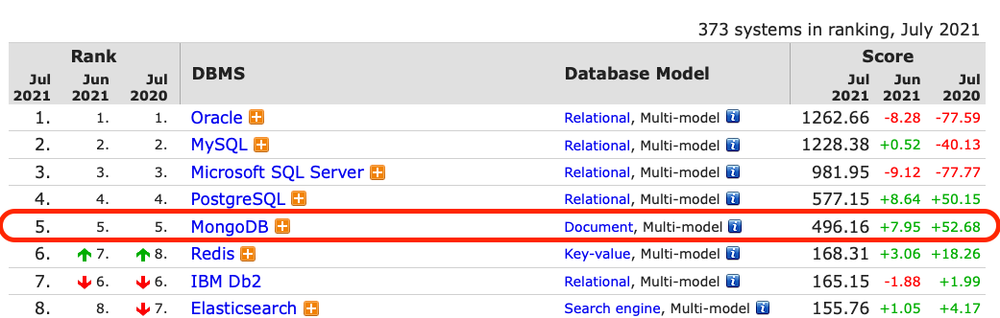

# mongoDB_study

본 저장소는 mongoDB에 대한 자료 조사 내용을 가지고 있다. 

# MongoDB 란?
MongoDB는 C++로 작성된 오픈소스 문서지향(Document-Oriented)적 Cross-platform 데이터 베이스이며, 뛰어난 확장성과 성능을 자랑한다. 또한, 2021년 기준 전체 DBMS 중 5위를 차지하고 있고, NoSQL 중에서는 1위를 유지할 정도로 많은 인기를 누리고 있다. 



## DBMS에서 문서지향(Document-Oriented)은 무엇을 의미하는 걸까?

문서 지향적 데이터 베이스는 JSON 유사 형식의 문서로 데이터를 저장 및 쿼리하도록 설계된 비관계형 데이터베이스 유형이다.
```
예시 :
[
    {
        "year" : 2013,
        "title" : "Turn It Down, Or Else!",
        "info" : {
            "directors" : [ "Alice Smith", "Bob Jones"],
            "release_date" : "2013-01-18T00:00:00Z",
            "rating" : 6.2,
            "genres" : ["Comedy", "Drama"],
            "image_url" : "http://ia.media-imdb.com/images/N/O9ERWAU7FS797AJ7LU8HN09AMUP908RLlo5JF90EWR7LJKQ7@@._V1_SX400_.jpg",
            "plot" : "A rock band plays their music at high volumes, annoying the neighbors.",
            "actors" : ["David Matthewman", "Jonathan G. Neff"]
        }
    },
    {
        "year": 2015,
        "title": "The Big New Movie",
        "info": {
            "plot": "Nothing happens at all.",
            "rating": 0
        }
    }
]
```

## MongoDB의 Collection
Collection은 MongoDB Document의 그룹이다. Elasticsearch와 매칭시켜서 보면 index와 동일하다고 보면 된다. 

## 장점
 - Schema-less : schema가 없다는 것은 key-value 모델로도 볼 수 있다는 장점이 있다. 
 - 각 객체 구조가 뚜렷하다.
 - 복잡한 JOIN이 없다. 
 - 문서지향적 Query Language를 사용하여 강력한 성능을 제공한다. 
 - 어플리케이션에서 사용되는 객체를 데이터베이트세 추가할 때, Conversion / Mapping이 불필요하다. 

## 단점 
 - 복잡한 쿼리 사용 불가능
 - 메모리 사용량이 큰 편이다. 
 - 데이터 일관성이 보장되지 않는다. 

# Docker MongoDB 설치

1. 이미지 다운로드 : `docker pull mongo`

2. 구동 : `docker run --name mongodb_server -v /Users/yoon-yeoungjin/Desktop/git_repository/mongoDB_study/db:/data/db -d -p 27017:27017 mongo`
    - `--name`      : 컨데이너 이름 설정
    - `-v`          : 볼륨을 외부와 연결 --> 위 명령어에서는 db볼륨을 외부로 연결
    - `-d`          : 데몬으로 실행
    - `-p`          : 외부 접속을 위해 포트 연결

3. Bash 접근 및 MongoDB 접속
    - `docker exec -it mongodb_server bash`
    - `mongo`

# 간단 사용 방법

- 데이터베이스 생성
    ```
    > use mongodb_tutorial
    switched to db mongodb_tutorial
    ```
- 현재 사용중인 데이터베이스 확인
    ```
    > db
    mongodb_tutorial
    ```
- 내가 만든 데이터베이스 리스트 및 용량 확인
    ```
    > show dbs
    admin   0.000GB
    config  0.000GB
    local   0.000GB
    ```
    위 결과를 보면 우리는 `mongodb_tutorial` 데이터베이스를 만들었는데 보여지지 않는다. 이유는 데이터베이스를 보려면 최소 한개의 도큐먼트를 추가해야되기 때문이다. 따라서 다음과 같이 입력하면 볼 수 있다. 
    ```
    > db.book.insert({"name" : "MongoDB Tutorial", "author" : "velopert"});
    WriteResult({ "nInserted" : 1 })
    > show dbs
    admin             0.000GB
    config            0.000GB
    local             0.000GB
    mongodb_tutorial  0.000GB
    ```
- 데이터베이스 제거
    ```
    > db.dropDatabase();
    { "ok" : 1 }
    > show dbs
    admin   0.000GB
    config  0.000GB
    local   0.000GB
    ```
- Collection 생성

    | Field     | Type    | 설명                                                                                                                                                                                                                                        |
    |-----------|---------|---------------------------------------------------------------------------------------------------------------------------------------------------------------------------------------------------------------------------------------------|
    | capped    | Boolean | 이 값을 true 로 설정하면 capped collection 을 활성화 시킵니다. Capped collection 이란, 고정된 크기(fixed size) 를 가진 컬렉션으로서, size 가 초과되면 가장 오래된 데이터를 덮어씁니다. 이 값을 true로 설정하면 size 값을 꼭 설정해야합니다. |
    | size      | number  | Capped collection 을 위해 해당 컬렉션의 최대 사이즈(maximum size)를 ~ bytes로 지정합니다. |
    | max       | number  | 해당 컬렉션에 추가 할 수 있는 최대 갯수를 설정합니다.|
    - ex_1 : test 데이터베이스에 books 컬렉션을 옵션 없이 생성
        ```
        > db.createCollection("books")
        { "ok" : 1 }
        ```
    - ex_2 : test 데이터베이스에 articles 컬렉션을 옵션과 함께 생성
        ```
        > db.createCollection("articles", { capped: true, size: 6142800, max: 10000 })
        { "ok" : 1 }
        ```
    - ex_3 : 따로 `createCollection()` 메소드를 사용하지 않아도 도큐먼트를 추가하면 자동으로 컬렉션이 생성된다.
        ```
        > db.people.insert({"name" : "yyj"})
        WriteResult({ "nInserted" : 1 })
        ```
    - collection 리스트 확인
        ```
        > show collections
        articles
        books
        people
        ```
- Collection 제거
    ```
    > show collections
    articles
    books
    people
    > db.people.drop()
    true
    > show collections
    articles
    books
    ```
- 도큐먼트 추가 : `db.COLLECTION_NAME.insert(document)`
  - ex_1 : 한개의 도큐먼트를 books 컬렉션에 추가.
    ```
    > db.books.insert({"name" : "mongodb gide", "author" : "yyj"})
    WriteResult({ "nInserted" : 1 })
    ```
  - ex_2 : 두개의 도큐먼트를 books 컬렉션에 추가. 
    ```
    > db.books.insert([
    ... {"name": "book1", "author" : "yyj"}
    ... {"name": "book2", "author" : "yyj"}
    ... ]);
    BulkWriteResult({
        "writeErrors" : [ ],
        "writeConcernErrors" : [ ],
        "nInserted" : 2,
        "nUpserted" : 0,
        "nMatched" : 0,
        "nModified" : 0,
        "nRemoved" : 0,
        "upserted" : [ ]
    })
    ```
  - ex_3 : 컬렉션의 도큐먼트 리스트 확인.
    ```
    > db.books.find()
    { "_id" : ObjectId("60f636174ac0ab80c78b671b"), "name" : "mongodb gide", "author" : "yyj" }
    { "_id" : ObjectId("60f636974ac0ab80c78b671c"), "name" : "book1", "author" : "yyj" }
    { "_id" : ObjectId("60f636974ac0ab80c78b671d"), "name" : "book2", "author" : "yyj" }
    ```

- 도큐먼트 제거 : `db.COLLECTION_NAME.remove(criteria, justOne)`

    | parameter | type     | 설명|
    |-----------|----------|------------------------------|
    | *criteria | document | 삭제 할 데이터의 기준 값 (criteria) 입니다. 이 값이 { } 이면 컬렉션의 모든 데이터를 제거합니다. |
    | justOne   | boolean  | 선택적(Optional) 매개변수이며 이 값이 true 면 1개 의 다큐먼트만 제거합니다. 이 매개변수가 생략되면 기본값은 false 로 서, criteria에 해당되는 모든 다큐먼트를 제거합니다. |

    - ex. books 컬렉션에서 "name"이 "book1"인 도큐먼트 제거
        ```
        > db.books.find({ "name" : "book1"})
        { "_id" : ObjectId("60f636974ac0ab80c78b671c"), "name" : "book1", "author" : "yyj" }
        > db.books.remove({"name" : "book1"})
        WriteResult({ "nRemoved" : 1 })
        > db.books.find()
        { "_id" : ObjectId("60f636174ac0ab80c78b671b"), "name" : "mongodb gide", "author" : "yyj" }
        { "_id" : ObjectId("60f636974ac0ab80c78b671d"), "name" : "book2", "author" : "yyj" }
        ```

- 도큐먼트 조회 : `db.COLLECTION_NAME.find(query, projection)`
    - 테스트 데이터 : 
        ```
        [
            {
                "title": "article01",
                "content": "content01",
                "writer": "Velopert",
                "likes": 0,
                "comments": []
            },
            {
                "title": "article02",
                "content": "content02",
                "writer": "Alpha",
                "likes": 23,
                "comments": [
                    {
                        "name": "Bravo",
                        "message": "Hey Man!"
                    }
                ]
            },
            {
                "title": "article03",
                "content": "content03",
                "writer": "Bravo",
                "likes": 40,
                "comments": [
                    {
                        "name": "Charlie",
                        "message": "Hey Man!"
                    },
                    {
                        "name": "Delta",
                        "message": "Hey Man!"
                    }
                ]
            }
        ]
        ```
    - ex_1 : 모든 데이터 조회.
        ```
        > db.articles.find()
        { "_id" : ObjectId("60f774999f0a4b946a4014d5"), "title" : "article01", "content" : "content01", "writer" : "Velopert", "likes" : 0, "comments" : [ ] }
        { "_id" : ObjectId("60f774999f0a4b946a4014d6"), "title" : "article02", "content" : "content02", "writer" : "Alpha", "likes" : 23, "comments" : [ { "name" : "Bravo", "message" : "Hey Man!" } ] }
        { "_id" : ObjectId("60f774999f0a4b946a4014d7"), "title" : "article03", "content" : "content03", "writer" : "Bravo", "likes" : 40, "comments" : [ { "name" : "Charlie", "message" : "Hey Man!" }, { "name" : "Delta", "message" : "Hey Man!" } ] }
        ```
        이 명령어 뒤에 `.pretty()` 옵션을 주면 더 이쁘게 볼 수 있다. 
    - ex_2 : writer값이 'Velopert'인 도큐먼트 조회
        ```
        > db.articles.find({"writer":"Velopert"}).pretty()
        {
            "_id" : ObjectId("60f774999f0a4b946a4014d5"),
            "title" : "article01",
            "content" : "content01",
            "writer" : "Velopert",
            "likes" : 0,
            "comments" : [ ]
        }
        ```
    - ex_3 : likes 값이 30 이하인 도큐먼트 조회
        ```
        > db.articles.find( {"likes" : {$lte : 30} } )
        { "_id" : ObjectId("60f774999f0a4b946a4014d5"), "title" : "article01", "content" : "content01", "writer" : "Velopert", "likes" : 0, "comments" : [ ] }
        { "_id" : ObjectId("60f774999f0a4b946a4014d6"), "title" : "article02", "content" : "content02", "writer" : "Alpha", "likes" : 23, "comments" : [ { "name" : "Bravo", "message" : "Hey Man!" } ] }
        ```


# `find()`에서 쿼리문 사용법.
- 비교 연산자.
<center>

| operator | 설명                                                   |
|----------|--------------------------------------------------------|
| $eq      | (equals) 주어진 값과 일치하는 값                       |
| $gt      | (greater than) 주어진 값보다 큰 값                     |
| $gte     | (greather than or equals) 주어진 값보다 크거나 같은 값 |
| $lt      | (less than) 주어진 값보다 작은 값                      |
| $lte     | (less than or equals) 주어진 값보다 작거나 같은 값     |
| $ne      | (not equal) 주어진 값과 일치하지 않는 값               |
| $in      | 주어진 배열 안에 속하는 값                             |
| $nin     | 주어빈 배열 안에 속하지 않는 값                        |

</center>

- 논리 연산자

<center>

| operator | 설명                                   |
|----------|----------------------------------------|
| $or      | 주어진 조건중 하나라도 true 일 때 true |
| $and     | 주어진 모든 조건이 true 일 때 true     |
| $not     | 주어진 조건이 false 일 때 true         |
| $nor     | 주어진 모든 조건이 false 일때 true     |

</center>

 - 정규식 패턴 사용 : `$regex` 연산자를 이용하여 Document를 정규식을 통해 찾을 수 있다. 이 연산자는 다음과 같은 형식으로 사용되어진다.
    ```
    { <field>: { $regex: /pattern/, $options: '<options>' } }
    { <field>: { $regex: 'pattern', $options: '<options>' } }
    { <field>: { $regex: /pattern/<options> } }
    { <field>: /pattern/<options> }
    ```
    ex.
    ```
    > db.articles.find( { "title" : /article0[1-2]/ } )
    { "_id" : ObjectId("56c0ab6c639be5292edab0c4"), "title" : "article01", "content" : "content01", "writer" : "Velopert", "likes" : 0, "comments" : [ ] }
    { "_id" : ObjectId("56c0ab6c639be5292edab0c5"), "title" : "article02", "content" : "content02", "writer" : "Alpha", "likes" : 23, "comments" : [ { "name" : "Bravo", "message" : "Hey Man!" } ] }
    ```
    옵션은 다음 표와 같다. 

<center>

| option | 설명                                                        |
|--------|-------------------------------------------------------------|
| i      | 대소문자 무시                                               |
| m      | 정규식에서 anchor(^) 를 사용 할 때 값에 \n 이 있다면 무력화 |
| x      | 정규식 안에있는 whitespace를 모두 무시                      |
| s      | dot (.) 사용 할 떄 \n 을 포함해서 매치                      |

</center>

이 외에 다양한 옵션들이 있다. 이는 https://velopert.com/479 를 참고하자.

# `find()` 메소드 활용 - `sort(), limit(), skip()`
`sort(), limit(), skip()` 메소드에 대해서 활용하는데 다음 테스트 데이터를 사용한다.
```
[
    { "_id": 1, "item": { "category": "cake", "type": "chiffon" }, "amount": 10 },
    { "_id": 2, "item": { "category": "cookies", "type": "chocolate chip" }, "amount": 50 },
    { "_id": 3, "item": { "category": "cookies", "type": "chocolate chip" }, "amount": 15 },
    { "_id": 4, "item": { "category": "cake", "type": "lemon" }, "amount": 30 },
    { "_id": 5, "item": { "category": "cake", "type": "carrot" }, "amount": 20 },
    { "_id": 6, "item": { "category": "brownies", "type": "blondie" }, "amount": 10 }
]
```
```
> db.orders.insert(sample data)
```

## `cursor.sort(DOCUMENT)` : 데이터를 정렬.

 - `DOCUMENT` : `{key : value}` 형식으로 전달. 이때 `value` 값은 1(오름차순) 또는 -1(내림차순) 이다. 

 ```
 > db.orders.find().sort({"_id" : 1})
{ "_id" : 1, "item" : { "category" : "cake", "type" : "chiffon" }, "amount" : 10 }
{ "_id" : 2, "item" : { "category" : "cookies", "type" : "chocolate chip" }, "amount" : 50 }
{ "_id" : 3, "item" : { "category" : "cookies", "type" : "chocolate chip" }, "amount" : 15 }
{ "_id" : 4, "item" : { "category" : "cake", "type" : "lemon" }, "amount" : 30 }
{ "_id" : 5, "item" : { "category" : "cake", "type" : "carrot" }, "amount" : 20 }
{ "_id" : 6, "item" : { "category" : "brownies", "type" : "blondie" }, "amount" : 10 }
 ```

 ```
 > db.orders.find().sort({"_id" : -1})
{ "_id" : 6, "item" : { "category" : "brownies", "type" : "blondie" }, "amount" : 10 }
{ "_id" : 5, "item" : { "category" : "cake", "type" : "carrot" }, "amount" : 20 }
{ "_id" : 4, "item" : { "category" : "cake", "type" : "lemon" }, "amount" : 30 }
{ "_id" : 3, "item" : { "category" : "cookies", "type" : "chocolate chip" }, "amount" : 15 }
{ "_id" : 2, "item" : { "category" : "cookies", "type" : "chocolate chip" }, "amount" : 50 }
{ "_id" : 1, "item" : { "category" : "cake", "type" : "chiffon" }, "amount" : 10 }

 ```

## `cursor.limit(value)` : 출력할 데이터 갯수를 제한.
```
> db.orders.find().limit(3)
{ "_id" : 1, "item" : { "category" : "cake", "type" : "chiffon" }, "amount" : 10 }
{ "_id" : 2, "item" : { "category" : "cookies", "type" : "chocolate chip" }, "amount" : 50 }
{ "_id" : 3, "item" : { "category" : "cookies", "type" : "chocolate chip" }, "amount" : 15 }
```

## `cursor.skip(value)` : 출력할 데이터의 시작 부분 설정

 - 앞에서 부터 `value`개의 데이터를 생략하고 그 다음부터 출력.
```
> db.orders.find().skip(2)
{ "_id" : 3, "item" : { "category" : "cookies", "type" : "chocolate chip" }, "amount" : 15 }
{ "_id" : 4, "item" : { "category" : "cake", "type" : "lemon" }, "amount" : 30 }
{ "_id" : 5, "item" : { "category" : "cake", "type" : "carrot" }, "amount" : 20 }
{ "_id" : 6, "item" : { "category" : "brownies", "type" : "blondie" }, "amount" : 10 }
```

# `update()`를 이용하여 데이터 수정

| Parameter    | Type     | 설명                                                                                                                                                              |
|--------------|----------|-------------------------------------------------------------------------------------------------------------------------------------------------------------------|
| *query       | document | 업데이트 할 document의 criteria 를 정합니다. find() 메소드 에서 사용하는 query 와 같습니다.                                                                       |
| *update      | document | document에 적용할 변동사항입니다.                                                                                                                                 |
| upsert       | boolean  | Optional. (기본값: false) 이 값이 true 로 설정되면 query한 document가 없을 경우, 새로운 document를 추가합니다.                                                    |
| multi        | boolean  | Optional. (기본값: false)  이 값이 true 로 설정되면, 여러개의 document 를 수정합니다.                                                                             |
| writeConcern | document | Optional.  wtimeout 등 document 업데이트 할 때 필요한 설정값입니다. 기본 writeConcern을 사용하려면 이 파라미터를 생략하세요. 자세한 내용은 매뉴얼을 참조해주세요. |

## 특정 field 업데이트 하기

 name : "Abet"의 age를 20으로 변경.
 ```
 > db.people.find({name : "Abet"})
{ "_id" : ObjectId("60f77d779f0a4b946a4014d8"), "name" : "Abet", "age" : 19 }

> db.people.update({name : "Abet"}, {$set : {age : 20}})
WriteResult({ "nMatched" : 1, "nUpserted" : 0, "nModified" : 1 })

> db.people.find({name : "Abet"})
{ "_id" : ObjectId("60f77d779f0a4b946a4014d8"), "name" : "Abet", "age" : 20 }
 ```

위와 같이 특정 field의 값을 수정할 때, `$set` 연산자를 사용한다. 이와 같은 방법으로 새로운 field를 추가할 수 있다.

```
> db.people.find({"name" : "Abet"})
{ "_id" : ObjectId("60f77d779f0a4b946a4014d8"), "name" : "Abet", "age" : 20 }

> db.people.update({"name" : "Abet"}, {$set : {sex : "male"}})
WriteResult({ "nMatched" : 1, "nUpserted" : 0, "nModified" : 1 })

> db.people.find({"name" : "Abet"})
{ "_id" : ObjectId("60f77d779f0a4b946a4014d8"), "name" : "Abet", "age" : 20, "sex" : "male" }
```

## 도큐먼트 replace 하기

name : Betty 도큐먼트를 새로운 도큐먼드로 replace 할 수 있다. 
```
> db.people.find({name : "Betty"})
{ "_id" : ObjectId("60f77d779f0a4b946a4014d9"), "name" : "Betty", "age" : 20 }

> db.people.update({name:"Betty"}, {"name" : "yyj" , age : 25})
WriteResult({ "nMatched" : 1, "nUpserted" : 0, "nModified" : 1 })
'
> db.people.find({"_id" : ObjectId("60f77d779f0a4b946a4014d9")})
{ "_id" : ObjectId("60f77d779f0a4b946a4014d9"), "name" : "yyj", "age" : 25 }
```

## 특정 필드 제거하기

name : David의 scroe 필드를 제거해보자.
```
> db.people.find({name : "David"})
{ "_id" : ObjectId("60f77d779f0a4b946a4014db"), "name" : "David", "age" : 23, "score" : 20 }

> db.people.update({name : "David"}, { $unset : {score : 1}})
WriteResult({ "nMatched" : 1, "nUpserted" : 0, "nModified" : 1 })

>  db.people.find({name : "David"})
{ "_id" : ObjectId("60f77d779f0a4b946a4014db"), "name" : "David", "age" : 23 }
```
`$unset`을 사용하여 특정 필드를 제거할 수 있다. 이떄 1은 true를 의미한다.

## 기준에 해당되는 도큐먼트가 존재하지 않는다면 새로 추가.

우리는 `update()` 메소드를 사용할 떄, 업데이트할 도큐먼트 기준을 세운다. 근데 기준에 해당하는 도큐먼트가 존재하지 않을때, 새로 추가하는 옵션 `{upsert : true}`가 존재한다. 이에 대한 예시는 다음과 같다.

```
> db.people.find({name : "Eilly"}) // 데이터가 존재하지 않아서 아무런 값도 나오지 않음.
> db.people.update({name : "Eilly"}, {name : "Eilly", age : 17}, {upsert : true})
WriteResult({
	"nMatched" : 0,
	"nUpserted" : 1,
	"nModified" : 0,
	"_id" : ObjectId("60f7829998f8e4f452753e3e")
})
> db.people.find({name : "Eilly"})
{ "_id" : ObjectId("60f7829998f8e4f452753e3e"), "name" : "Eilly", "age" : 17 }
```

## 여러 도큐먼트의 특정 필드 수정.

여러 도큐먼트를 수정할 때, `{multi : true}` 옵션을 추가해야 한다. 

나이가 20살 이하인 도큐먼트틀에 score 값을 10으로 수정한다. 
```
> db.people.find({age : {$lte :20}})
{ "_id" : ObjectId("60f77d779f0a4b946a4014d8"), "name" : "Abet", "age" : 20, "sex" : "male" }
{ "_id" : ObjectId("60f7829998f8e4f452753e3e"), "name" : "Eilly", "age" : 17 }

> db.people.update({age:{$lte:20}}, {$set : {score : 10}}, {multi : true})
WriteResult({ "nMatched" : 2, "nUpserted" : 0, "nModified" : 2 })

> db.people.find({age : {$lte :20}})
{ "_id" : ObjectId("60f77d779f0a4b946a4014d8"), "name" : "Abet", "age" : 20, "sex" : "male", "score" : 10 }
{ "_id" : ObjectId("60f7829998f8e4f452753e3e"), "name" : "Eilly", "age" : 17, "score" : 10 }
```

## 배열 값 수정하기.

- 배열에 값 추가하기 : `$push` 사용 
```
> db.people.find({name : "Charlie"})
{ "_id" : ObjectId("60f77d779f0a4b946a4014da"), "name" : "Charlie", "age" : 23, "skills" : [ "mongodb", "nodejs" ] }

> db.people.update({name : "Charlie"}, {$push : {skills : "angularjs"}})
WriteResult({ "nMatched" : 1, "nUpserted" : 0, "nModified" : 1 })

> db.people.find({name : "Charlie"})
{ "_id" : ObjectId("60f77d779f0a4b946a4014da"), "name" : "Charlie", "age" : 23, "skills" : [ "mongodb", "nodejs", "angularjs" ] }
```

- 배열에 값 여러개 추가 : `$each`+  오름차순으로 정렬 : `$sort`

```
> db.people.update({name : "Charlie"}, {$push: { skills : { $each : ["c++", "java"], $sort : 1}}})
WriteResult({ "nMatched" : 1, "nUpserted" : 0, "nModified" : 1 })

> db.people.find({name : "Charlie"})
{ "_id" : ObjectId("60f77d779f0a4b946a4014da"), "name" : "Charlie", "age" : 23, "skills" : [ "angularjs", "c++", "java", "mongodb", "nodejs" ] }
```
`$sort` 에서 1은 오름차순, -1은 내림차순을 의미한다.

## 배열 값 제거하기. 
배열에 있는 값을 제거하는데 공통적으로 `$pull` 을 사용한다.
- Charlie 도큐먼트에서 배열에 있는 값 `mongodb`를 제거하기.
```
> db.people.find({name : "Charlie"})
{ "_id" : ObjectId("60f77d779f0a4b946a4014da"), "name" : "Charlie", "age" : 23, "skills" : [ "angularjs", "c++", "java", "mongodb", "nodejs" ] }

> db.people.update({name : "Charlie"}, {$pull : {skills : "mongodb"}})
WriteResult({ "nMatched" : 1, "nUpserted" : 0, "nModified" : 1 })

> db.people.find({name : "Charlie"})
{ "_id" : ObjectId("60f77d779f0a4b946a4014da"), "name" : "Charlie", "age" : 23, "skills" : [ "angularjs", "c++", "java", "nodejs" ] }
```

- 배열에서 여러개 값 제거하기.  `$in ` 추가 사용
```
> db.people.update({name : "Charlie"}, {$pull : {skills : {$in : ["angularjs", "java"]}}})

WriteResult({ "nMatched" : 1, "nUpserted" : 0, "nModified" : 1 })
> db.people.find({name : "Charlie"})
{ "_id" : ObjectId("60f77d779f0a4b946a4014da"), "name" : "Charlie", "age" : 23, "skills" : [ "c++", "nodejs" ] }
```


# 출처
 - aws 문서 : https://aws.amazon.com/ko/nosql/document/
 - MongoDB 전반적인 내용 : https://velopert.com/436 ~ https://velopert.com/545
 - MongoDB 장단점 : https://elky84.github.io/2018/09/26/mongodb/
-  pymongo 라이브러리 : https://www.fun-coding.org/mongodb_basic5.html
